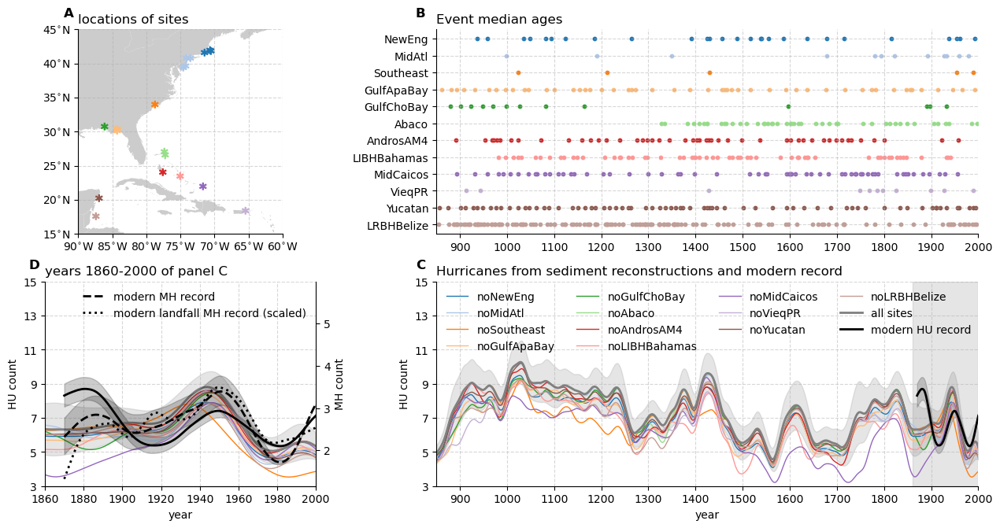

# LastMillenniumHurricanes
North Atlantic hurricanes over the last millennium.

### main figures and associated data files

[Fig01.py](LMHU/Fig01.py)

[Fig01.pdf](LMHU/Fig01.pdf)  
[fig_map_sites.py](LMHU/fig_map_sites.py)  
[fig_map_sites.png](LMHU/fig_map_sites.png)  
[fig_map_sites.csv](LMHU/fig_map_sites.csv)  
[fig_scatter_ages.png](LMHU/fig_scatter_ages.py)  
[fig_scatter_ages.csv](LMHU/fig_scatter_ages.csv)  
[fig_scatter_ages.png](LMHU/fig_scatter_ages.png)  
[fig_lines_sedimentHUcount.py](LMHU/fig_lines_sedimentHUcount.py)  
[fig_lines_sedimentHUcount.png](LMHU/fig_lines_sedimentHUcount.png)  
[fig_lines_sedimentHUcount.nc](LMHU/fig_lines_sedimentHUcount.nc)  
[fig_lines_sedimentHUcount__MH.nc](LMHU/fig_lines_sedimentHUcount__MH.nc)  

[Fig02.py](LMHU/Fig02.py)

[Fig02.pdf](LMHU/Fig02.pdf)  
[fig_map_ssta.py](LMHU/fig_map_ssta.py)  
[fig_map_ssta.png](LMHU/fig_map_ssta.png)  
[fig_map_ssta__LMR2018.nc](LMHU/fig_map_ssta__LMR2018.nc)  
[fig_map_ssta__LMR2019.nc](LMHU/fig_map_ssta__LMR2019.nc)  
[fig_lines_lmrMDRtrop.py](LMHU/fig_lines_lmrMDRtrop.py)  
[fig_lines_lmrMDRtrop.png](LMHU/fig_lines_lmrMDRtrop.png)  
[fig_lines_lmrMDRtrop__LMR2018.nc](LMHU/fig_lines_lmrMDRtrop__LMR2018.nc)  
[fig_lines_lmrMDRtrop__LMR2019.nc](LMHU/fig_lines_lmrMDRtrop__LMR2019.nc)  
[fig_lines_lmrHU.py](LMHU/fig_lines_lmrHU.py)  
[fig_lines_lmrHU.png](LMHU/fig_lines_lmrHU.png)  
[fig_lines_lmrHU__LMR2018HU.nc](LMHU/fig_lines_lmrHU__LMR2018HU.nc)  
[fig_lines_lmrHU__LMR2019HU.nc](LMHU/fig_lines_lmrHU__LMR2019HU.nc)  
[fig_lines_lmrHU__modernHU.nc](LMHU/fig_lines_lmrHU__modernHU.nc)  
[fig_lines_lmrHU__sedimentHU.nc](LMHU/fig_lines_lmrHU__sedimentHU.nc)  

[Fig03.py](LMHU/Fig03.py)

[Fig03__rSST__alpha10.pdf](LMHU/Fig03__rSST__alpha10.pdf)  
[Fig03__FLORrSST.nc](LMHU/Fig03__FLORrSST.nc)  
[Fig03__LMR2019rSST.nc](LMHU/Fig03__LMR2019rSST.nc)  
[Fig03__rSST__pyleoclim__alpha10.png](LMHU/Fig03__rSST__pyleoclim__alpha10.png)  
[Fig03__FLORrSST_pyleoclim.nc](LMHU/Fig03__FLORrSST_pyleoclim.nc)  
[Fig03__LMR2019rSST_pyleoclim.nc](LMHU/Fig03__LMR2019rSST_pyleoclim.nc)  

[Fig04.py](LMHU/Fig04.py)

[Fig04.pdf](LMHU/Fig04.pdf)  
[fig_lines_lmeHU.py](LMHU/fig_lines_lmeHU.py)  
[fig_lines_lmeHU.png](LMHU/fig_lines_lmeHU.png)  
[fig_lines_lmeHU.nc](LMHU/fig_lines_lmeHU.nc)  
[fig_lines_lmeHU__ctl.nc](LMHU/fig_lines_lmeHU__ctl.nc)  
[fig_lines_LMErMDRa](LMHU/fig_lines_LMErMDRa.py)  
[fig_lines_LMErMDRa.png](LMHU/fig_lines_LMErMDRa.png)  
[fig_lines_LMErMDRa.nc](LMHU/fig_lines_LMErMDRa.nc)  
[fig_lines_LMErMDRa__ctl.nc](LMHU/fig_lines_LMErMDRa__ctl.nc)  
[fig_lines_lmeTROPa.py](LMHU/fig_lines_lmeTROPa.py)  
[fig_lines_lmeTROPa.png](LMHU/fig_lines_lmeTROPa.png)  
[fig_lines_lmeTROPa.nc](LMHU/fig_lines_lmeTROPa.nc)  
[fig_lines_lmeTROPa__ctl.nc](LMHU/fig_lines_lmeTROPa__ctl.nc)  

### supplementary figures and data

[FigS_heatmaps_corr_liz_lmr.py](LMHU/FigS_heatmaps_corr_liz_lmr.py)  
  
[FigS_heatmaps_corr_liz_lmr__lmr2018hu.nc](LMHU/FigS_heatmaps_corr_liz_lmr__lmr2018hu.nc)  
[FigS_heatmaps_corr_liz_lmr__lmr2018mh.nc](LMHU/FigS_heatmaps_corr_liz_lmr__lmr2018mh.nc)  
[FigS_heatmaps_corr_liz_lmr__lmr2019hu.nc](LMHU/FigS_heatmaps_corr_liz_lmr__lmr2019hu.nc)  
[FigS_heatmaps_corr_liz_lmr__lmr2019mh.nc](LMHU/FigS_heatmaps_corr_liz_lmr__lmr2019mh.nc)  
[FigS_heatmaps_corr_liz_lmr__pyleoclim.png](LMHU/FigS_heatmaps_corr_liz_lmr__pyleoclim.png)  
[FigS_heatmaps_corr_liz_lmr__lmr2018hu_pyleoclim.nc](LMHU/FigS_heatmaps_corr_liz_lmr__lmr2018hu_pyleoclim.nc)  
[FigS_heatmaps_corr_liz_lmr__lmr2018mh_pyleoclim.nc](LMHU/FigS_heatmaps_corr_liz_lmr__lmr2018mh_pyleoclim.nc)  
[FigS_heatmaps_corr_liz_lmr__lmr2019hu_pyleoclim.nc](LMHU/FigS_heatmaps_corr_liz_lmr__lmr2019hu_pyleoclim.nc)  
[FigS_heatmaps_corr_liz_lmr__lmr2019mh_pyleoclim.nc](LMHU/FigS_heatmaps_corr_liz_lmr__lmr2019mh_pyleoclim.nc)  

[FigS_pdf_corr_sedimentHU_LME.py](LMHU/FigS_pdf_corr_sedimentHU_LME.py)  
  
[FigS_pdf_corr_sedimentHU_LME.nc](LMHU/FigS_pdf_corr_sedimentHU_LME.nc)  

[FigS_maps_corr_tc_sst.py](LMHU/FigS_maps_corr_tc_sst.py)  
  
[FigS_maps_corr_tc_sst__FLORSST.nc](LMHU/FigS_maps_corr_tc_sst__FLORSST.nc)  
[FigS_maps_corr_tc_sst__LMR2019SST.nc](LMHU/FigS_maps_corr_tc_sst__LMR2019SST.nc)  

[FigS_maps_corr_tc_sst__LMR2019SST.nc](LMHU/FigS_maps_ssta_LMR2019.py)  
  
[FigS_maps_ssta_LMR2019.png](LMHU/FigS_maps_ssta_LMR2019__1400-1440.nc)  
[FigS_maps_ssta_LMR2019__1400-1440_rSST.nc](LMHU/FigS_maps_ssta_LMR2019__1400-1440_rSST.nc)  
[FigS_maps_ssta_LMR2019__1706-1746.nc](LMHU/FigS_maps_ssta_LMR2019__1706-1746.nc)  
[FigS_maps_ssta_LMR2019__1706-1746_rSST.nc](LMHU/FigS_maps_ssta_LMR2019__1706-1746_rSST.nc)  

[FigS_maps_ssta_LME.py](LMHU/FigS_maps_ssta_LME.py)  
  
[FigS_maps_ssta_LME__1257-1297.nc](LMHU/FigS_maps_ssta_LME__1257-1297.nc)  
[FigS_maps_ssta_LME__1257-1297_rSST.nc](LMHU/FigS_maps_ssta_LME__1257-1297_rSST.nc)  
[FigS_maps_ssta_LME__1960-2000.nc](LMHU/FigS_maps_ssta_LME__1960-2000.nc)  
[FigS_maps_ssta_LME__1960-2000_rSST.n](LMHU/FigS_maps_ssta_LME__1960-2000_rSST.nc)  

[FigS_heatmaps_corr_liz_lme_HU.py](LMHU/FigS_heatmaps_corr_liz_lme_HU.py)  
   
[FigS_heatmaps_corr_liz_lme_HU.nc](LMHU/FigS_heatmaps_corr_liz_lme_HU.nc)  

[FigS_pdf_corr_sedimentHU_LMR.py](LMHU/FigS_pdf_corr_sedimentHU_LMR.py)  
  
[FigS_pdf_corr_sedimentHU_LMR__lmr2018.nc](LMHU/FigS_pdf_corr_sedimentHU_LMR__lmr2018.nc)  
[FigS_pdf_corr_sedimentHU_LMR__lmr2019.nc](LMHU/FigS_pdf_corr_sedimentHU_LMR__lmr2019.nc)  
